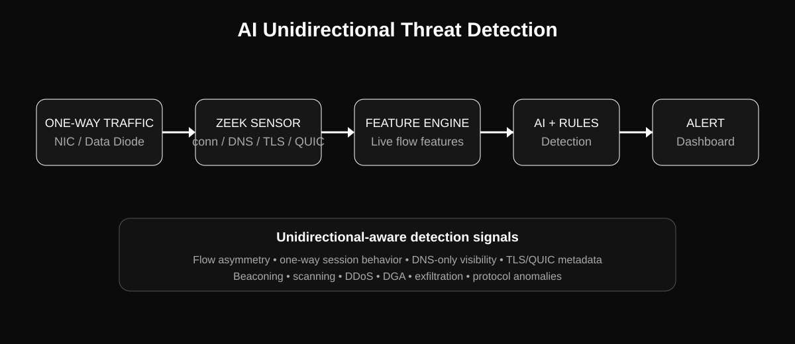

# AI Unidirectional Threat Detection

AI-powered passive network threat detection for **one-way / unidirectional traffic**. The system captures traffic with Zeek, converts live logs into flow features, runs detection models and rules, and streams alerts to a dashboard.



## Architecture

```text
ONE-WAY TRAFFIC
      ↓
ZEek SENSOR
      ↓
LIVE ZEEK LOGS
      ↓
FEATURE EXTRACTION
      ↓
AI/ML + RULE DETECTORS
      ↓
THREAT SCORING
      ↓
LIVE DASHBOARD / ALERT
```

The application is designed around **passive monitoring**. It does not need to actively scan the monitored network.

## Current live pipeline

- Detects available network interfaces.
- Starts and stops Zeek from the application.
- Uses a dedicated live-log directory.
- Tails Zeek logs without requiring manual log files.
- Extracts live flow features.
- Runs rule-based detections for scanning, DDoS, beaconing and related traffic patterns.
- Has an ML runtime with model/schema validation.
- Streams live detection events through FastAPI WebSockets.
- Dashboard provides live interface controls, status and threat events.
- Historical PCAPs/datasets are retained only for development, testing and model training; live monitoring does not depend on manually supplied traffic data.

## Unidirectional features we can add

These are useful specifically because normal bidirectional network assumptions do not always hold.

### 1. Directionality / asymmetry score
Measure how strongly a flow behaves as one-way traffic using packet, byte and timing statistics.

### 2. One-way session detector
Identify sessions where packets consistently travel in only one observed direction. Useful for data-diode and passive sensor deployments.

### 3. Egress-only exfiltration detection
Detect unusual outbound byte volume, long-lived flows, burst patterns and destination changes when return traffic is unavailable.

### 4. Ingress-only attack detection
Detect floods, scanning and abnormal connection attempts from the traffic entering the monitored enclave.

### 5. DNS-only anomaly detection
Use DNS request-side metadata such as query length, entropy, NXDOMAIN rate, domain diversity and request frequency when response traffic is not visible.

### 6. TLS ClientHello fingerprinting
Use visible TLS handshake metadata such as SNI, version, cipher/extension characteristics and JA3/JA4-style fingerprints where available, without requiring payload inspection.

### 7. QUIC metadata analysis
Detect unusual QUIC traffic patterns from the metadata visible to the sensor, including destination concentration and timing/volume anomalies.

### 8. Beaconing without response packets
Model periodic outbound connection attempts using inter-arrival timing, destination stability and burst regularity even when the corresponding response direction is absent.

### 9. Protocol-aware one-way baselines
Maintain separate normal baselines for DNS, HTTP-like traffic, TLS, QUIC, industrial/OT protocols and other protocols observed in the deployment.

### 10. Data-diode health monitoring
Add a dedicated health signal for unexpected reverse-direction packets, traffic gaps, interface loss, Zeek failure and sensor/log stalls.

### 11. Unidirectional flow correlation
Correlate multiple one-way observations by source, destination, port, protocol and time window instead of relying on a conventional two-way connection record.

### 12. Adaptive threat scoring
Combine directionality, rate, entropy, protocol metadata and model confidence into a transparent threat score with the contributing signals shown in the dashboard.

## Detection roadmap

| Capability | Status |
|---|---|
| Live Zeek control | Implemented |
| Live Zeek log reader | Implemented |
| Live feature extraction | Implemented |
| Rule-based live detection | Implemented |
| FastAPI live API | Implemented |
| WebSocket live events | Implemented |
| Dashboard live controls | Implemented |
| ML runtime/schema validation | Implemented |
| ML models trained on exact live schema | **Remaining** |
| ML predictions connected to dashboard verdicts | **Remaining** |
| Alert deduplication | **Remaining** |
| Unidirectional-aware feature set | **Next feature phase** |
| Full real-NIC end-to-end validation | **Remaining** |
| Cross-platform deployment validation | **Remaining** |

## Setup

The launcher performs a Zeek preflight before starting the dashboard. Live capture is only considered ready after Zeek is started on the selected interface and the live `conn.log` path is verified.

### Linux

Install Python dependencies:

```bash
./scripts/setup.sh
```

Then start the application:

```bash
python app.py
```

Linux package installation uses the local package manager when possible. Zeek also publishes official Linux binary packages through the openSUSE Build Service; some distributions may need that repository configured manually. Live packet capture still requires the appropriate privileges.

### macOS

Install dependencies and start the application:

```bash
python3 -m venv .venv
source .venv/bin/activate
python -m pip install -r requirements.txt
python app.py
```

The launcher can install Zeek with Homebrew when Homebrew is available. Live capture may require elevated packet-capture permissions.

### Windows

Zeek's native Windows support is **experimental**. Live capture requires both the Npcap runtime and a Zeek build linked against the Npcap SDK; the normal Windows libpcap build is not sufficient for live capture. The project does not redistribute an unofficial Zeek binary or Npcap SDK.

Run PowerShell as Administrator:

```powershell
Set-ExecutionPolicy -Scope Process Bypass
.\\scripts\\windows\\setup-zeek.ps1
```

The helper installs/uses the build prerequisites it can automate, checks for Npcap, finds the Npcap SDK, configures Zeek with `-DPCAP_ROOT_DIR`, and builds a project-local `zeek.exe`. After the build, start the app normally:

```powershell
python app.py
```

The app automatically detects the project-local Windows Zeek binary. You still need a valid Npcap installation, Npcap SDK, and supported Visual Studio/MSVC developer environment; those are external Windows prerequisites.


Open the dashboard at:

```text
http://127.0.0.1:9000
```

FastAPI is available at:

```text
http://127.0.0.1:8000
```

## API

- `GET /health` — backend health
- `GET /api/live/status` — live sensor status and interfaces
- `POST /api/live/start` — start live monitoring
- `POST /api/live/stop` — stop live monitoring
- `WS /ws/threats` — live threat events

Example start request:

```json
{
  "interface": "wlan0"
}
```

The interface is selected from the interfaces detected on the machine; it is not hardcoded by the dashboard.

## Project structure

```text
backend/              FastAPI backend and live service
src/zeek/             Zeek lifecycle and installation helpers
src/ingest/            PCAP and live Zeek readers
src/features/          Network feature extraction
src/detection/         Rules and live detection pipeline
src/models/            ML training and runtime inference
dashboard.py           Flask dashboard
templates/             Dashboard UI
tests/                 Automated tests
docs/                  Architecture and project documentation
data/                  Local training/test data and runtime output
```

## Important ML note

The live runtime validates model artifacts against the features available from the live Zeek pipeline. This prevents an incompatible model from being presented as a valid live detector.

The next ML step is to train/validate the deployed models using the **same feature schema produced by live Zeek traffic**, then connect those predictions directly to the dashboard's flow verdicts.

## Testing

Run:

```bash
source .venv/bin/activate
pytest -q
```

The Zeek manager also has a live-capture smoke check that starts Zeek on a selected interface, verifies the live `conn.log` path, and cleans the sensor up again. This is stronger than checking only `zeek --version`, but a real deployment still needs a real-NIC test with controlled traffic on each target operating system.

## Security notes

- Monitoring is passive; do not use this project to disrupt or interfere with networks you do not own or have permission to monitor.
- Keep captured traffic and logs protected because network metadata can contain sensitive information.
- Run the sensor with the minimum privileges required for packet capture.
- Do not commit live logs, credentials, PCAPs containing sensitive traffic, or generated Python cache files.

## License

See [LICENSE](LICENSE).


## Train the seven unidirectional models

Training data stays local and is never committed to the repository. Point the
batch trainer at a directory containing CICIDS/CICFlowMeter CSV files:

```bash
python -m src.models.train_all_unidirectional /path/to/cicids_csvs src/models/pkl
```

It produces:

- `bot_unidirectional.pkl`
- `ddos_unidirectional.pkl`
- `dos_unidirectional.pkl`
- `infiltration_unidirectional.pkl`
- `patator_unidirectional.pkl`
- `portscan_unidirectional.pkl`
- `webattack_unidirectional.pkl`

The runtime automatically prefers these artifacts when they exist and falls
back to the legacy detector artifacts otherwise. The trainer prints a
classification report for each detector; those metrics must be reviewed before
using response actions.

## User-confirmed response

A threat score at or above the configured response threshold creates a response
offer only. The dashboard asks for explicit confirmation before calling
`POST /api/live/response`. Blocking is performed on the monitored host using
the platform firewall and is never automatic.
