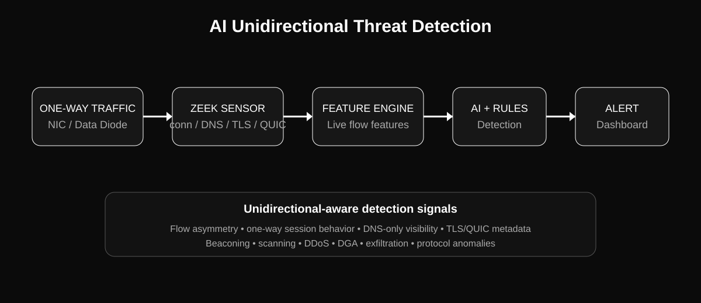

# AI Unidirectional Threat Detection

AI-powered passive network threat detection for **one-way / unidirectional traffic**. The system captures traffic with Zeek, converts live logs into flow features, runs detection models and rules, and streams alerts to a dashboard.



## Architecture

```text
ONE-WAY TRAFFIC
      ↓
ZEek SENSOR
      ↓
LIVE ZEEK LOGS
      ↓
FEATURE EXTRACTION
      ↓
AI/ML + RULE DETECTORS
      ↓
THREAT SCORING
      ↓
LIVE DASHBOARD / ALERT
```

The application is designed around **passive monitoring**. It does not need to actively scan the monitored network.

## Current live pipeline

- Detects available network interfaces.
- Starts and stops Zeek from the application.
- Uses a dedicated live-log directory.
- Tails Zeek logs without requiring manual log files.
- Extracts live flow features.
- Runs the live detection gate from `src/detection`: scanning, DDoS, beaconing, DGA when DNS query telemetry is present, forward-only exfiltration, and TLS/QUIC traffic identification.
- Routes any source flagged by the detection layer into the seven unidirectional ML models; packet ML does not run on unflagged sources.
- Has an ML runtime with model/schema validation.
- Streams live detection events through FastAPI WebSockets.
- Dashboard provides live interface controls, status and threat events.
- Historical PCAPs/datasets are retained only for development, testing and model training; live monitoring does not depend on manually supplied traffic data.

## Unidirectional detection model

The live ML engine uses a strict forward-only feature schema. It does not feed Bwd/Backward features or aggregate fields such as Total Packets / Total Bytes into the ML models.

The same unidirectional observation can support multiple threat families. DDoS is only one detector; the runtime loads separate unidirectional artifacts for DDoS, DoS, PortScan, Infiltration, Patator, WebAttack and Bot/Net behavior. The live packet-derived ML path is limited to the features defined by the runtime schema. The first-stage gate uses every detector for which the live telemetry is available. DGA requires a `query` field; TLS/QUIC identification uses observed protocol/port information. The encrypted module does not claim that ordinary TLS/QUIC is malicious.

## Detection roadmap

| Capability | Status |
|---|---|
| Live Zeek control | Implemented |
| Live Zeek log reader | Implemented |
| Live feature extraction | Implemented |
| Live detection gate (scanning/DDoS/beaconing/DGA/exfiltration/TLS-QUIC identification) | Implemented when required telemetry is present |
| Dashboard Zeek-log DGA detection | Implemented |
| Dashboard Zeek-log exfiltration detection | Implemented |
| Live DGA detection from DNS query telemetry | Implemented when query telemetry is supplied |
| Live TLS/QUIC traffic identification | Implemented; this is identification, not anomaly scoring |
| FastAPI live API | Implemented |
| WebSocket live events | Implemented |
| Dashboard live controls | Implemented |
| ML runtime/schema validation | Implemented |
| ML models trained on exact live schema | Implemented |
| ML predictions connected to live event stream | Implemented |
| Alert deduplication | Implemented |
| Unidirectional-aware feature set | Implemented |
| Full real-NIC end-to-end validation | **Remaining** |
| Cross-platform deployment validation | **Remaining** |

## Setup

The normal launcher is designed as a one-command entry point. On first run it creates a project-local `.venv`, installs/updates the packages in `requirements.txt`, checks Zeek, and then starts the backend and dashboard. A dependency marker prevents a full reinstall on every launch; it is refreshed automatically when `requirements.txt` changes.

The launcher performs a Zeek preflight before starting the dashboard. Live capture is only considered ready after Zeek is started on the selected interface and the live `conn.log` path is verified.

The launcher also handles capture privileges. On Linux and macOS, a normal user launch requests `sudo` and relaunches the project with the required privileges. On Windows, the launcher requests UAC administrator elevation. The elevated process is marked internally so it does not repeatedly relaunch itself.

This elevation is used because the live sensor opens packet-capture interfaces directly. The application does not silently disable capture or pretend that live monitoring is working when the operating system denies access.

Startup diagnostics now distinguish common failures such as missing/blocked packet-capture permissions, unavailable interfaces, and Windows Npcap/libpcap problems. The API returns these messages to the dashboard instead of exposing only a generic startup failure.

### Linux

Install Python dependencies:

```bash
./scripts/setup.sh
```

Then start the application:

```bash
python app.py
```

Linux package installation uses the local package manager when possible. Zeek also publishes official Linux binary packages through the openSUSE Build Service; some distributions may need that repository configured manually. Live packet capture still requires the appropriate privileges.

### macOS

The normal entry point is:

```bash
python3 app.py
```

If Zeek is missing, the launcher automatically bootstraps Homebrew using Homebrew's official installer, then installs Zeek with:

```bash
brew install zeek
```

Homebrew currently provides a Zeek formula with macOS binary bottles, so the project does not need to build Zeek from source on macOS.

The Homebrew bootstrap may still require normal macOS administrator authentication or Command Line Tools setup.

For development dependencies, create the virtual environment once:

```bash
python3 -m venv .venv
source .venv/bin/activate
python -m pip install -r requirements.txt
```

Live capture may require the appropriate packet-capture permissions.

### Windows

Zeek's native Windows support is **experimental**. Live capture requires Npcap and a Zeek build linked against the Npcap SDK; the normal Windows libpcap build is not sufficient for live capture.

The normal entry point is now:

```powershell
python app.py
```

If Zeek is missing, `app.py` automatically launches the project Windows bootstrap. The bootstrap can request UAC elevation, enable required Windows Developer Mode support, install build dependencies through WinGet, install Npcap, configure Zeek with the Npcap SDK, and build a project-local Zeek executable.

**One unavoidable manual step:** the free Npcap installer can show its normal installer/UAC prompts. We do not redistribute Npcap or embed it in this repository.

Once Zeek is built, rerun:

```powershell
python app.py
```

Open the dashboard at:

```text
http://127.0.0.1:9000
```

FastAPI is available at:

```text
http://127.0.0.1:8000
```

## API

- `GET /health` — backend health
- `GET /api/live/status` — live sensor status and interfaces
- `POST /api/live/start` — start live monitoring
- `POST /api/live/stop` — stop live monitoring
- `POST /api/live/response` — explicitly confirmed block/unblock action
- `WS /ws/threats` — live threat events

Example start request:

```json
{
  "interface": "wlan0"
}
```

The interface is selected from the interfaces detected on the machine; it is not hardcoded by the dashboard.

## Project structure

```text
backend/              FastAPI backend and live service
src/zeek/             Zeek lifecycle and installation helpers
src/ingest/            PCAP and live Zeek readers
src/features/          Network feature extraction
src/detection/         Rules, first-stage flagging, and live detection pipeline
src/models/            ML training and runtime inference
dashboard.py           Flask dashboard
templates/             Dashboard UI
tests/                 Automated tests
docs/                  Architecture and project documentation
data/                  Local training/test data and runtime output
```

## ML runtime

The live runtime now loads and validates the seven deployed unidirectional model artifacts:

- `bot_unidirectional.pkl`
- `ddos_unidirectional.pkl`
- `dos_unidirectional.pkl`
- `infiltration_unidirectional.pkl`
- `patator_unidirectional.pkl`
- `portscan_unidirectional.pkl`
- `webattack_unidirectional.pkl`

Each artifact must declare the exact forward-only feature schema and the supported `random_forest_unidirectional` model type. Legacy bidirectional detector artifacts are ignored by live inference.

The live packet-derived ML predictions are connected to the FastAPI event stream and dashboard. The dashboard distinguishes the winning model's ML confidence from the overall threat score. The current threat score is the strongest malicious model confidence for the observed flow; it is not a calibrated ensemble probability.

A threat score at or above the configured **92% response threshold** creates a response offer only. The dashboard requires explicit user confirmation before calling `POST /api/live/response`; blocking is never automatic.

## Training the seven unidirectional models

Training data stays local and is never committed to the repository. Point the batch trainer at a directory containing CICIDS/CICFlowMeter CSV files:

```bash
python -m src.models.train_all_unidirectional /path/to/cicids_csvs src/models/pkl
```

The trainer uses the same `UNIDIRECTIONAL_FEATURES` contract as live inference and produces the seven artifacts above. It also prints classification reports so the model metrics can be reviewed before enabling response actions.

## Testing

Run:

```bash
source .venv/bin/activate
pytest -q
```

CI runs the automated test suite on pushes to the repository. The test suite covers feature-contract isolation, model artifact validation, live pipeline behavior, detection rules, dashboard data paths, and response-policy behavior.

The Zeek manager also has a live-capture smoke check that starts Zeek on a selected interface, verifies the live `conn.log` path, and cleans the sensor up again. A real deployment still needs a controlled real-NIC test with representative traffic on each target operating system.

## Security notes

- Monitoring is passive; do not use this project to disrupt or interfere with networks you do not own or have permission to monitor.
- Keep captured traffic and logs protected because network metadata can contain sensitive information.
- Run the sensor with the minimum privileges required for packet capture.
- Store optional Gemini credentials such as `GEMINI_API_KEY` in the local environment or `.env`; never commit them.
- Do not commit live logs, credentials, PCAPs containing sensitive traffic, or generated Python cache files.

## License

See [LICENSE](LICENSE).
